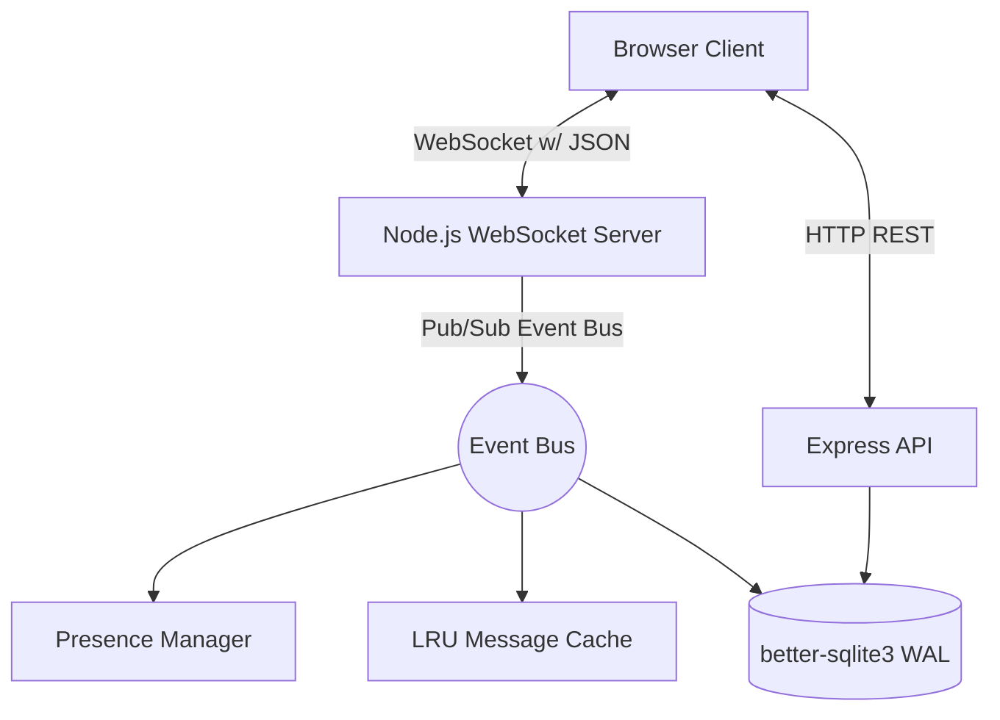

# Real-Time Chat System

## The Why
Building a production-grade real-time messaging system requires robust architectural decisions. This project demonstrates a scale-ready design by utilizing an event-driven architecture, resilient WebSockets with auto-reconnects, efficient connection health monitoring (heartbeats), and an optimized database setup using `better-sqlite3` in WAL mode for highly concurrent read operations. 

It aims to provide a reliable, fast, and resilient messaging experience similar to WhatsApp or Slack, ensuring messages are delivered, acknowledged, and persisted consistently.

## Architecture Diagram

## Trade-offs
1. **`ws` over `Socket.io`**: We use the native `ws` library instead of `Socket.io` to demonstrate raw control over the WebSocket lifecycle. This enables fine-tuned heartbeat mechanisms and bespoke acknowledgment protocols without the overhead of Socket.io's built-in abstractions.
2. **LRU Cache Design**: Implementing a custom in-memory LRU cache helps simulate Redis-like fast data retrieval for hot messages. It trades overall system memory for speed, dropping oldest items predictably.
3. **WAL mode SQLite**: `better-sqlite3` with Write-Ahead Logging (WAL) significantly increases concurrency, allowing multiple readers to access the database without blocking writers. While it doesn't replace a distributed database for massive scale, it provides maximum performance for a single-node setup.
4. **Scale-up vs Scale-out**: This implementation focuses on scaling up a single Node.js instance (efficient memory/CPU usage). To scale out horizontally across multiple instances, see [SCALE.md](./SCALE.md).

## Quick Start

1. **Install dependencies**:
   \`\`\`bash
   npm install
   \`\`\`

2. **Start the server**:
   \`\`\`bash
   npm start
   \`\`\`

3. **Open the client**:
   Navigate to [http://localhost:3000](http://localhost:3000) in multiple browser windows to test real-time chat.

## Scale Documentation
For details on how this system could scale to 10,000+ concurrent users, please refer to [SCALE.md](./SCALE.md).
