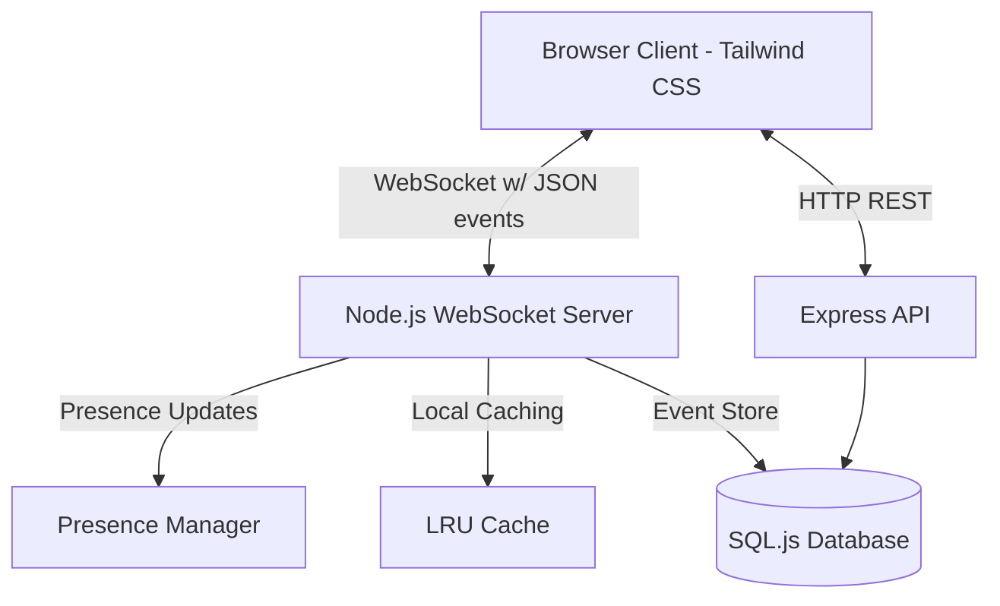

# 💬 NexusChat - Real-Time Enterprise Messenger

[](https://nodejs.org)
[](https://expressjs.com/)
[](https://github.com/websockets/ws)
[](https://tailwindcss.com)
[](https://github.com/sql-js/sql.js)
[](https://opensource.org/licenses/MIT)

An enterprise-ready, highly resilient, real-time communication platform built on raw WebSockets, event-driven architecture, and a modern Tailwind CSS design system. Designed to emulate WhatsApp Web or Slack under professional workloads.

---

## 📖 Table of Contents
- [The "Why"](#the-why)
- [System Architecture](#system-architecture)
- [Directory Structure](#directory-structure)
- [Key Features](#key-features)
- [Built With](#built-with)
- [Architectural Trade-offs](#architectural-trade-offs)
- [Quick Start](#quick-start)
- [Scale & Concurrency](#scale--concurrency)

---

## 💡 The "Why"
Traditional REST-based architectures are inadequate for real-time messaging due to high latency and resource-intensive polling. This project demonstrates:
- **Resilient Real-time Bidirectional Piping:** Direct WebSocket communication with custom client auto-reconnection and exponential backoff.
- **Heartbeat & Liveness Checks:** Automatic client termination for inactive sockets to prevent memory leaks and ghost sessions.
- **Optimized Persistence:** SQLite with in-memory caching layers (LRU cache) to drastically reduce database overhead.
- **Aesthetic Excellence:** An interactive interface powered by Tailwind CSS.

---

## 🛠️ System Architecture



---

## 📁 Directory Structure

```text
realtime-chat/
├── public/                 # Frontend assets
│   ├── components/
│   │   └── chat-app.js     # Light DOM Tailwind Web Component
│   ├── app.js              # Application entry/login coordinator
│   └── index.html          # HTML entry with Tailwind CSS v3 CDN
├── server/                 # Backend services (Clean Architecture)
│   ├── cache.js            # LRU Cache implementation
│   ├── db.js               # SQL.js connection and state management
│   ├── db-helper.js        # SQL query wrapper utility
│   ├── index.js            # Express API server coordinator
│   └── socket.js           # WebSocket connection manager
├── chat.db                 # Seed/Cache binary SQL storage
├── SCALE.md                # System scale analysis
└── package.json            # Dependencies
```

---

## ✨ Key Features
- **WhatsApp-style Glassmorphic UI:** Deep dark mode palette with emerald gradients, modern typography, and CSS micro-animations.
- **Light DOM Web Component:** Clean, reusable Web Components rendering inside the Light DOM to leverage Tailwind's full design utility ecosystem.
- **Robust Presence Engine:** Real-time online/offline indicators and last-seen updating.
- **Custom ACK Protocols:** Bidirectional message acknowledgment (sending, sent, read ticks).
- **Graceful Typings:** Fully documented using detailed JSDoc typings.

### V3 Upgrades
- **Worker Threads Cluster Simulator:** Implements a multithreading cluster simulator using Node.js `worker_threads` for scaling backend tasks.
- **Ping/Pong RTT Check:** Dynamically checks Round Trip Time (RTT). If RTT exceeds 500ms, sets an `X-Low-Bandwidth` header to conditionally skip media data in the backend.
- **Idempotent Message ACKs:** Prevents duplicate message processing via strict DB checks on message IDs.

---

## 🧱 Built With
- **Frontend:** Vanilla JS, Tailwind CSS (v3 CDN), HTML5 Web Components
- **Backend:** Node.js, Express, `ws` (native WebSockets)
- **Database:** `sql.js` (Pure JS SQLite compiler for cross-platform zero-dependency builds)

---

## ⚖️ Architectural Trade-offs

1. **`ws` Library vs. Socket.io**
   - *Decision:* Used raw `ws` library.
   - *Trade-off:* We lose Socket.io's ready-to-use room abstractions and fallback pooling, but we gain complete control over socket headers, memory lifecycles, and lightweight execution, crucial for high-concurrency performance.

2. **Light DOM Web Components**
   - *Decision:* Refactored components to render directly into Light DOM instead of Shadow DOM.
   - *Trade-off:* We lose complete stylesheet encapsulation, but we allow utility engines like Tailwind CSS to style elements dynamically and cohesively from the main document, avoiding the overhead of loading bulky style links within each shadow container.

3. **SQL.js vs. Distributed Databases**
   - *Decision:* Integrated SQL.js for portability.
   - *Trade-off:* Highly portable and guarantees a zero-setup startup, but does not support concurrent write locking at scale. A production version would transition to PostgreSQL or MongoDB.

---

## 🚀 Quick Start

### 1. Install Dependencies
```bash
npm install
```

### 2. Start the Server
```bash
npm start
```

### 3. Launch the Client
Open [http://localhost:3000](http://localhost:3000) in multiple private browser sessions to simulate real-time enterprise communication.

---

## 📈 Scale & Concurrency
For an in-depth breakdown of how this server scales to **10,000+ simultaneous connections** utilizing Redis adapters and cluster clustering, review the technical documentation at [SCALE.md](./SCALE.md).
